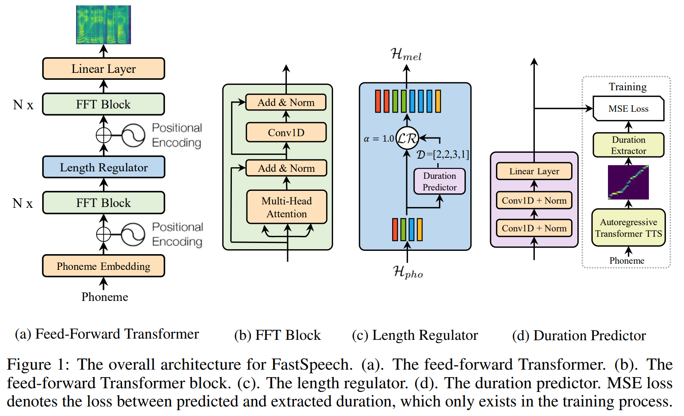

# Text-to-Speech

## Model

[FastSpeech](https://arxiv.org/pdf/1905.09263.pdf) Implementation.

<p>
    
</p>

## Notebook


## Getting Started

Clone the repository and step into it:

```shell
git clone https://github.com/khaykingleb/Text-to-Speech.git
cd Text-to-Speech
```

Install requirements and modules.

```shell
pip install -r requirements.txt
python setup.py install
```

Use for training:

```shell
python main.py -c configs/cofig_name.json
```
